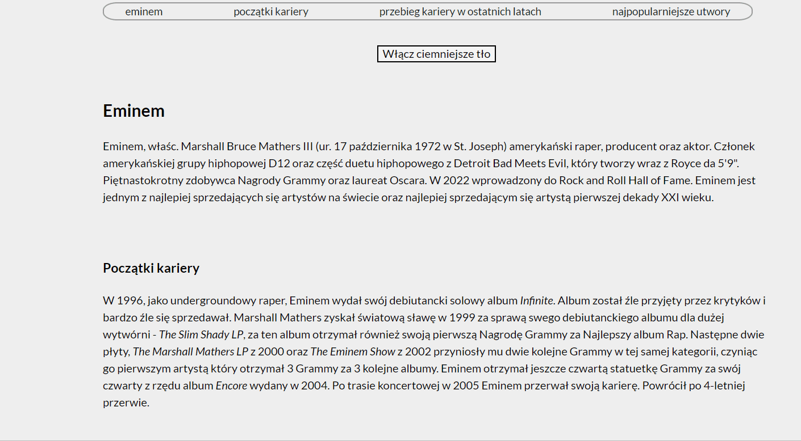

## Demo
https://krzysztof0607.github.io/homepage/
## Opis
The website is small blog about my favorite and so famous artist Eminem. Take a look if You like him too. :) 
## The page was created with below features, technologies and conventions:
- ES6+ features
- BEM convention
- arrow functions
- links
- deviding the page for sections
- semantic elements of the page: header,main, section, table, forms, nav, ul, li.
- classes and ids
- modification of HTML elements with addEventListener